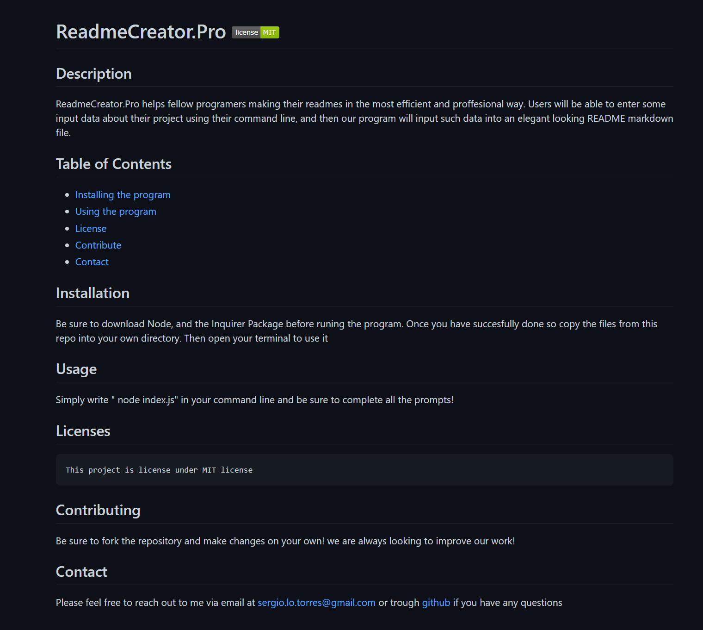
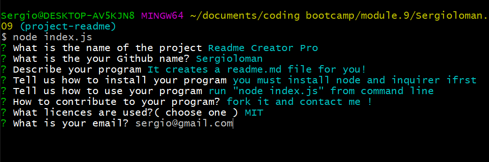

# Readme Generator -  Project 0.9

Welcome to our first Readme.md file generator. We have created this program using Node.js and the Inquirer NPM package. The program runs in the command line rather than in the browser. Below I will be breaking down the program features and its requirements
## Contents 
* [Requirements](#requirements)
* [Installation](#installation)
* [Features](#features)
* [Bonus](#bonus)

## Requirements

[Node.Js](https://nodejs.dev/) : 
Node is our main tool here and allows us to use javascript and communicate with our command line
[Inquirer.NPM](https://www.npmjs.com/package/inquirer) :

## Installation
This program relies heavily on Node.Js and the Inquirer. Be sure to both install Node, and execute Inquirer from your command line before running the program.

## Features
Creating a file from the command line require 2 major components, a way to enter and capture input from command line as well as creating a brand new file using the information from the command line. Below ill briefly describe the code used to fulfil this project:

* ### Index.js
Our index.js file holds our dependencies, packages, as well as our question arrays.

Here is also where we execute Inquirer and with the help of the path() property, we are able to create a file and redirect it to the desired location.

* ### generateMarkdown.js
The GenerateMarkdown.js file is able to pull data from index.js to then input it straight into a brand new readme file.

The readme file structure is made using template literals allowing us to input variables as well as html or markdown format. 

## Bonus
As always, be sure to dive into the JS files and read the comments. most functions and logic have been broken down and commented to make it more understandable.

### screenshots

